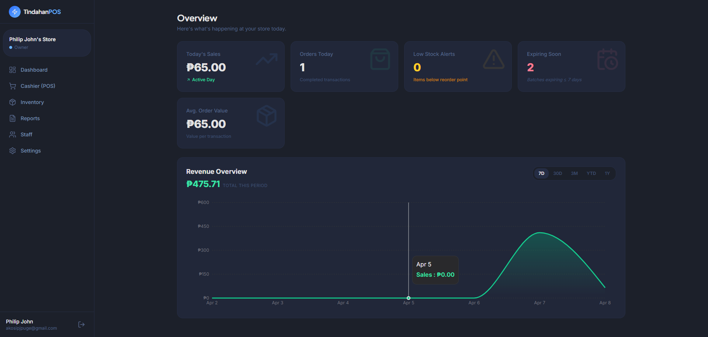
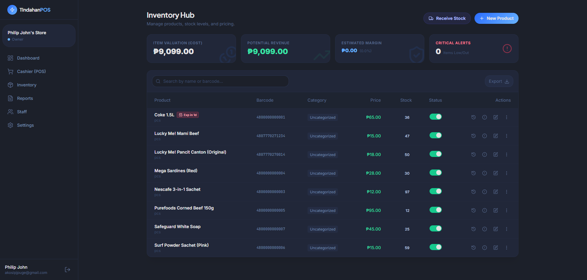
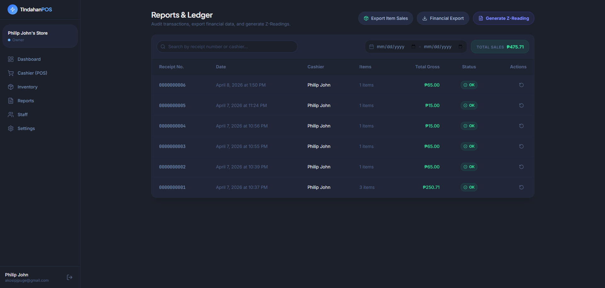
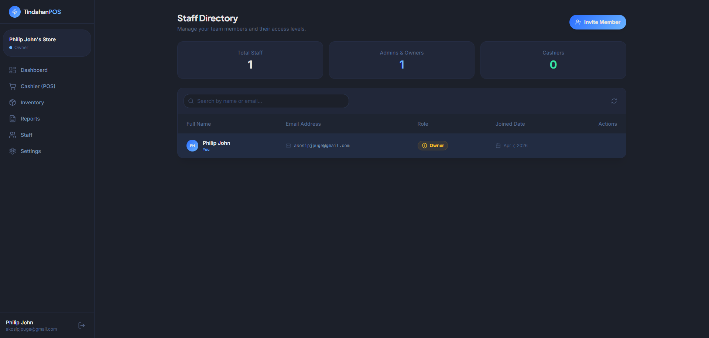
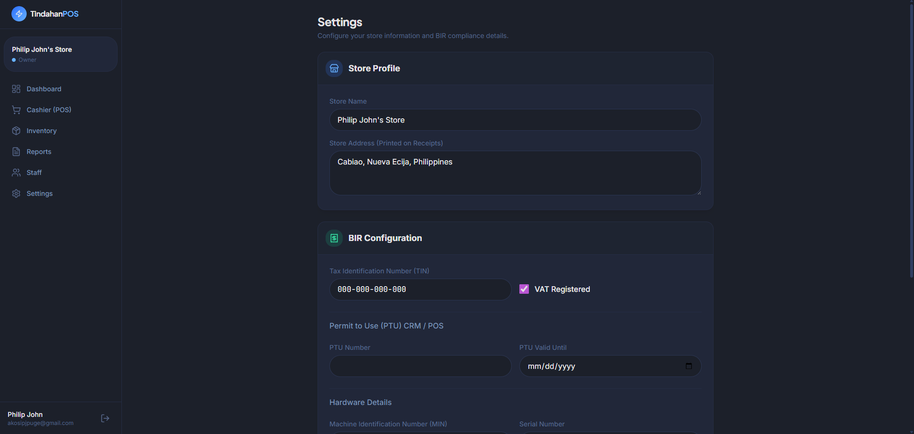

# 🏪 TindahanPOS by Chicken Kare Studio

> **A high-performance, BIR-ready Cloud POS built for Philippine MSMEs.**

TindahanPOS is a modern, cloud-native Point of Sale system tailored specifically for the Philippine retail landscape. Built for speed, reliability, and local regulatory compliance, it empowers small to medium enterprises (MSMEs) with professional tools for checkout, inventory, and reporting.

---

## 🚀 Live Demo
Experience the production environment here:  
👉 **[https://tindahan-pos.philipjohnn8nautomation.online](https://tindahan-pos.philipjohnn8nautomation.online)**

## 📸 Visual Preview

<p align="center">
  
  
</p>
<p align="center">
  
  
</p>
<p align="center">
  
  
</p>

---

## ✨ Core Features

### 🛒 Smart Checkout & Terminal
*   **Intuitive Cashier UI**: Built for speed and high-volume transactions.
*   **Dual Mode Input**: Search products manually or use a **Barcode Scanner** for instant lookups.
*   **Multi-Payment Support**: Accepts Cash and established e-wallets like **GCash** and **Maya**.
*   **Digital Printing**: Instant BIR-style receipt generation.

### 🇵🇭 Philippine Compliance (BIR-Ready)
*   **Built-in 12% VAT**: Automated VAT-inclusive pricing logic with clear "Vatable Sales" and "VAT Amount" breakdowns.
*   **Senior Citizen / PWD Support**: One-click 20% discount application and VAT-exempt calculation (following local laws).

### 📦 Professional Inventory Hub
*   **Advanced Batch Tracking (FIFO)**: Intelligent stock deduction logic that ensures oldest stock (or those expiring soonest) are sold first.
*   **Perishable Management**: Track **Expiry Dates** for every batch with automated Dashboard alerts for items expiring within 7 days.
*   **Live Valuation Analytics**: Real-time visibility into **Total Cost Value**, **Potential Revenue**, and **Estimated Margin**—know your "money on the shelves."
*   **Waste & Spoilage Logging**: Dedicated manual adjustment tool for recording damaged items or personal use, maintaining a perfect audit trail.
*   **Supplier Directory**: Link every stock delivery to specific suppliers for better procurement tracking.
*   **Bulk Import**: Instant **Excel/CSV upload** for large product catalogs—stock your store in seconds.
*   **Audit Trail**: Automated logging for every stock adjustment and transaction powered by PostgreSQL triggers.

### 📊 Analytics & Staff Management
*   **Executive Dashboard**: Real-time sales tracking and daily revenue metrics.
*   **Staff Directory**: Centralized management for Admins, Owners, and Cashiers with role-based access.
*   **Top Sellers**: Insights into trending products to optimize stock procurement.

---

## 🛠 Technical Stack

| Category | Technology |
| :--- | :--- |
| **Frontend** | [Next.js 14](https://nextjs.org/) (App Router), [Tailwind CSS](https://tailwindcss.com/) |
| **UI Components** | [Shadcn UI](https://ui.shadcn.com/), [Lucide React](https://lucide.dev/) |
| **Backend/DB** | [Supabase](https://supabase.com/) (PostgreSQL), Auth, Edge Functions |
| **Security** | Row Level Security (RLS) & JWT Authentication |
| **State Management** | [Zustand](https://zustand-demo.pmnd.rs/) (Cart/UI), [TanStack Query](https://tanstack.com/query/latest) (Server State) |

---

## ⚙️ Installation & Setup

Follow these steps to set up the development environment:

### 1. Clone the Repository
```bash
git clone https://github.com/your-username/tindahan-pos.git
cd tindahan-pos
```

### 2. Install Dependencies
```bash
npm install
```

### 3. Environment Configuration
Create a `.env.local` file in the root directory and add your Supabase credentials:
```env
NEXT_PUBLIC_SUPABASE_URL=your_supabase_url
NEXT_PUBLIC_SUPABASE_ANON_KEY=your_supabase_anon_key
```

### 4. Database Setup
TindahanPOS uses Supabase for data and authentication. Ensure your database tables are created according to the defined schema:
- `profiles`: User roles and store association.
- `stores`: Business-level information (TIN, etc.).
- `products`: Inventory and pricing.
- `transactions`: Order history and VAT breakdowns.
- `transaction_items`: Line-item details.

### 5. Run the Local Server
```bash
npm run dev
```
The app will be available at `http://localhost:3000`.

---

## 🗺 Future Roadmap
- [ ] **Offline Mode (PWA)**: Allow sales even during internet outages using local storage sync.
- [ ] **Z-Read Generation**: Automated X and Z-Reading reports for mandatory BIR end-of-day compliance.
- [ ] **Email Receipts**: Optional digital receipts sent directly to customer emails.

---

## 📄 License
TindahanPOS is a professional solution developed by **Chicken Kare Studio**. All rights reserved.

---

> Built with ❤️ for the Filipino MSME Community.
